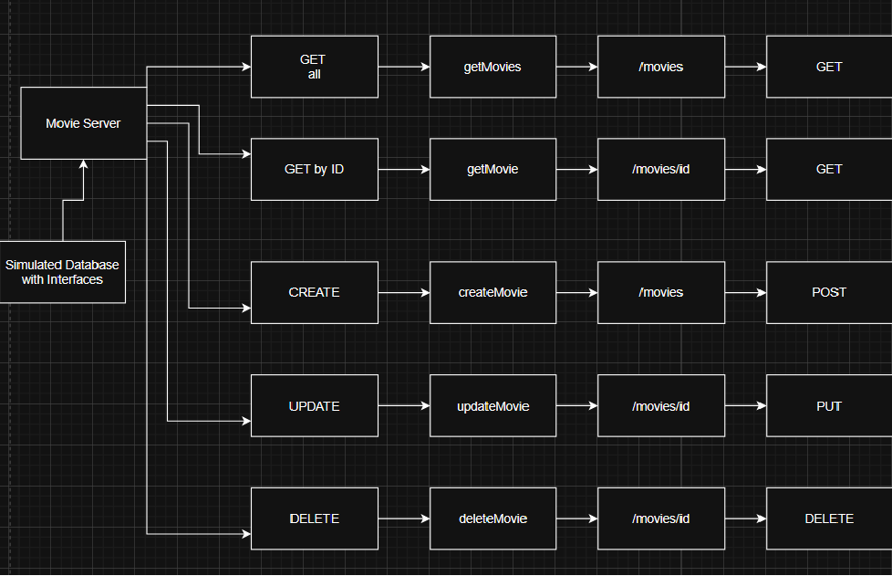

# 1. A Simple Web Server
## Working

Let me preface this by saying, if you stumbled across this repository while browsing my profile, this is me practicing GoLang!

In this repo, I have built a simple http web server. It has been made using http library, and it can simply take a request, and return a response. 

The server has 3 routes - 
- ```/ - root ```  takes you to "Static Website." page
- ```/form.html```  will show the form.html page, where you can add your name and address (this won't be stored, ofcourse) and then it returns a response, printing the name and address you gave it.
- ```/hello```  prints a simple "Hello, Gophers!" message.

# 2. A Simple Crud Application


- In this application, I have simulated a database using Structs. It is a database of movies. Now, I have built 4 REST APIs which can do the following:
1. Create a new movie entry
2. Updpate an existing entry
3. Delete an existing entry
4. GET all the movies
5. GET a movie by ID.
6. This is done without using a web-framework, but with http. I bind different functions to different API routes, and also set specific GET / PUT / PATCH / DELETE methods. 
7. This was my FIRST proper REST API using Go!

# 3. Boring

This is an example of using fan-in and fan-out using channels!
Channels BLOCK. We can use the channels to basically delegate a long, time-consuming task to multiple worker functions.
The functions will then write to a single channel.

```
Fan-out : When we have a large, time-consuming task, we can give it to multiple functions and launch multiple Go-Routines.
This will reduce the time taken.

Fan-in : We can have multiple channels from multiple go-routines write to a single channel, and read the final output from that channel.
```

Boring is an interesting, documented example given by Rob Pike (the GOAT). I am simply trying to implement it without looking.
